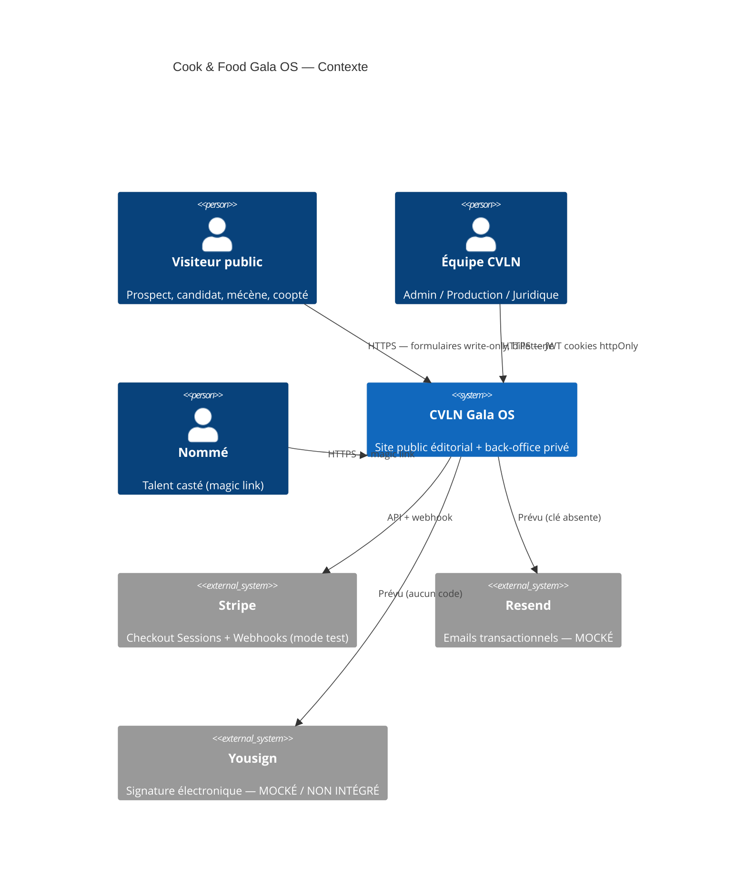
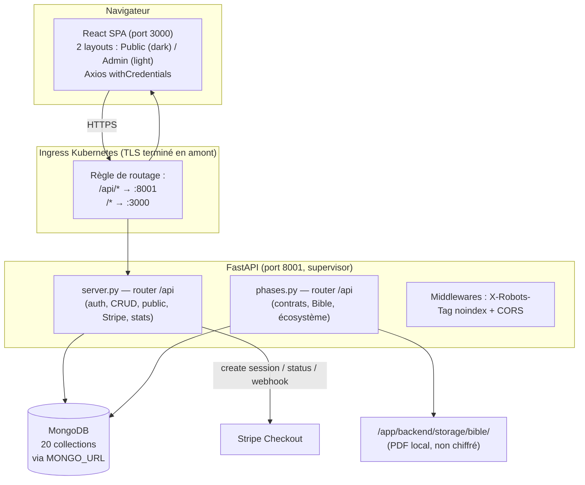
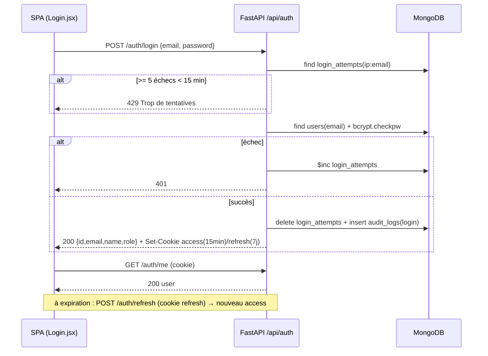
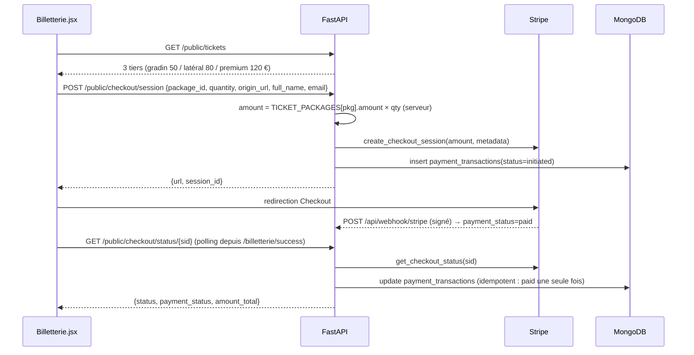
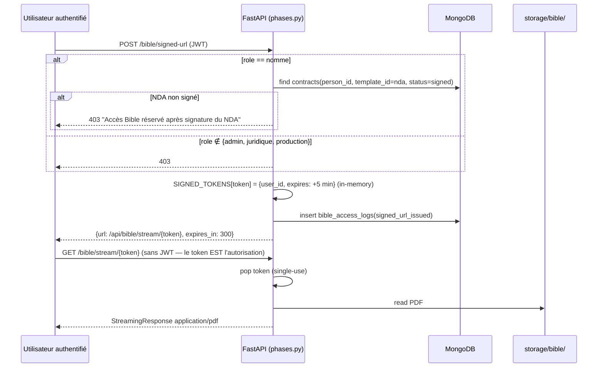
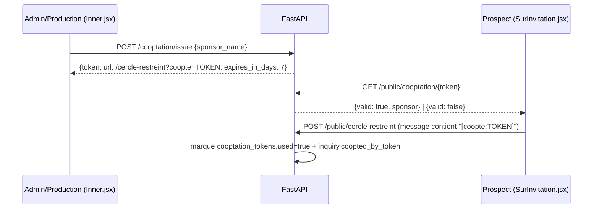
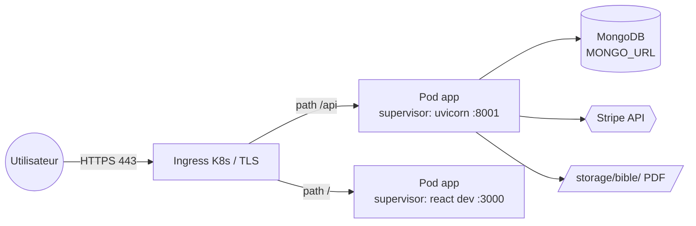

# 2. ARCHITECTURE LOGICIELLE

## 2.1 Architecture globale — C4 Niveau 1 (Contexte)

## 2.2 C4 Niveau 2 (Conteneurs) — ✅ OBSERVÉ

## 2.3 C4 Niveau 3 (Composants backend) — ✅ OBSERVÉ

| Composant | Fichier:lignes | Responsabilité |
|---|---|---|
| Auth Core | server.py:50–118 | bcrypt, JWT access/refresh, cookies, `get_current_user`, `require_role` |
| Auth Routes | server.py:276–389 | login (anti-brute-force), logout, me, refresh, magic-link |
| CRUD Production | server.py:395–492 | positions / people / assignments |
| Public Intake | server.py:498–625 | RSVP + 4 formulaires write-only + mécénat Stripe |
| Cooptation | server.py:640–705 | issue / check / list tokens 7 j |
| Billing | server.py:735–823 | tickets, checkout, status, webhook |
| Reporting | server.py:829–869 | dashboard stats, audit logs |
| Public Content | server.py:875–963 | prizes, ecosystem, countdown, health |
| Seeds | server.py:969–1044 + phases.py:511–555 | users, positions, ecosystem, founders |
| Contracts Engine | phases.py:293–400 | templates, rendu variables, workflow statut, PDF ReportLab |
| Bible Vault | phases.py:405–484 | upload, signed-url 5 min single-use (in-memory), stream, logs |
| Ecosystem Admin | phases.py:489–506 | CRUD nodes silencieux |

## 2.4 Architecture logique — séparation en 2 couches ✅ OBSERVÉ

- **Couche publique** : lecture de contenu non sensible (`/api/public/*`, prizes, ecosystem filtré `public_visible=true`, founders filtré) + **écriture seule** dans 6 collections d'intake. Aucun GET public ne retourne des données personnelles.
- **Couche privée** : toutes les routes non-`/api/public` exigent un JWT (`get_current_user`) ; les mutations exigent un rôle (`require_role`).
- Exceptions publiques par conception : `GET /api/public/cooptation/{token}` (validation token), `GET /api/bible/stream/{token}` (URL signée), `POST /api/webhook/stripe` (signature Stripe).

## 2.5 Architecture physique / Cloud / réseau

✅ OBSERVÉ (environnement) : conteneur Kubernetes ; supervisor gère `backend` (uvicorn 0.0.0.0:8001, hot reload) et `frontend` (dev server 3000) ; ingress route `/api` → 8001, reste → 3000 ; TLS terminé en amont de l'application (l'app ne gère pas de certificats).
❔ Topologie cloud de production cible (régions, réplication Mongo, CDN) : **non disponible dans le projet analysé.**
📋 RECOMMANDÉ : production = build statique React derrière CDN + uvicorn/gunicorn multi-workers + MongoDB Atlas répliqué + WAF.

## 2.6 Architecture sécurité (résumé — détail en 14_CYBERSECURITE)

✅ OBSERVÉ : JWT httpOnly/secure/samesite=none (access 15 min, refresh 7 j) ; RBAC 4 rôles ; anti-brute-force 5 essais / 15 min par `ip:email` (X-Forwarded-For pris en compte) ; honeypot anti-bot ; montants Stripe côté serveur ; `X-Robots-Tag` noindex sur `/api` ; Swagger désactivé (`docs_url=None`) ; audit log sur mutations ; anti-énumération d'emails sur magic-link (toujours 200).
⚠️ ÉCARTS OBSERVÉS : pas de HSTS/CSP applicatifs ; pas de rate limiting générique ; secrets fallback en dur ; mots de passe seed en dur ; Bible non chiffrée au repos ; tokens Bible in-memory (perdus au restart, non multi-worker) ; audit logs non immuables (collection Mongo standard) ; workflow contrats sans machine à états serveur.

## 2.7 Diagrammes de séquence — ✅ OBSERVÉ

### Authentification back-office

### Billetterie Stripe

### Accès Bible conditionnel

### Cooptation

## 2.8 Diagramme de déploiement — ✅ OBSERVÉ (environnement de preview)

## 2.9 Transversal

| Préoccupation | État |
|---|---|
| Gestion des erreurs | ✅ `HTTPException` FastAPI avec `detail` FR ; frontend `formatApiError()` normalise string/array/objet. ⚠️ ObjectId invalide non intercepté sur plusieurs routes → 500 (voir 14). |
| Journalisation | ✅ `logging` Python (INFO) + collection `audit_logs` (toutes mutations privées) + `bible_access_logs`. ⚠️ Non immuables. |
| Monitoring | ✅ `GET /api/health` (ping) et `GET /api/health/full` (Mongo, Stripe key, Resend mode, Bible storage, Yousign=mock, compteurs collections). ❔ APM/alerting externe : non disponible. |
| Observabilité | ❔ Traces distribuées, métriques Prometheus : non disponibles dans le projet analysé. |
| Sauvegardes | ❔ Aucun mécanisme de backup dans le code. 📋 mongodump chiffré quotidien + copie hors site recommandés. |
| Files d'attente / cache | ❔ Non disponibles dans le projet analysé (tout est synchrone). |
| i18n | ✅ Custom React (9 langues, fallback FR, persistance localStorage) — △ partiel : namespaces `nav`, `cta`, `hero`, `footer`, `invitation` uniquement ; le contenu éditorial des pages reste en FR. |
