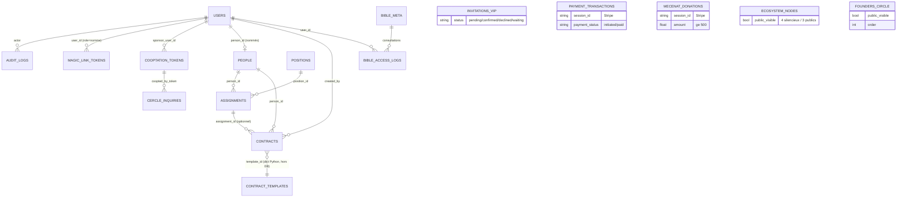

# 6. BASE DE DONNÉES

## 6.1 Technologie — ✅ OBSERVÉ
- **MongoDB**, accès asynchrone via **Motor 3.3.1** (`AsyncIOMotorClient(MONGO_URL)`, base `DB_NAME`).
- Schéma **implicite** (schemaless) : la structure est garantie par les modèles Pydantic à l'écriture, pas par des validateurs Mongo.
- Convention : `_id` ObjectId natif, exposé `id` string via `doc_out()`. Timestamps : chaînes ISO 8601 UTC (`datetime.now(timezone.utc).isoformat()`).
- ❔ Migrations, triggers, validations JSON-Schema Mongo : **non disponibles dans le projet analysé** (pas de framework de migration ; les seeds font office de jeu de données initial).

## 6.2 Collections (20) — champs observés à l'écriture

### Cœur système
| Collection | Champs | Index |
|---|---|---|
| `users` | `_id, email, password_hash (bcrypt), name, role ∈ {admin, production, juridique, nomme}, person_id? (nommés), created_at` | `email` **unique** |
| `login_attempts` | `identifier ("ip:email"), count, last_at` | `identifier` |
| `magic_link_tokens` | `token, user_id, email, expires_at (+20 min), used, used_at?` | `token` **unique** |
| `audit_logs` | `actor (user_id), action, entity, entity_id, meta{}, at` | — ⚠️ aucun index |

### Production
| Collection | Champs | Index |
|---|---|---|
| `positions` | `code (POS-01..25), title, pole (Pôle I–VII), description, created_at` | `code` **unique** |
| `people` | `full_name, email, phone, company, notes, created_at` | — |
| `assignments` | `position_id (ref str), person_id (ref str), start_date, end_date, status ∈ {active, ended}, fee_amount, deliverables, created_at` | — ⚠️ refs non indexées |

### Intake public (write-only)
| Collection | Champs |
|---|---|
| `invitations_vip` | `full_name, email, phone, seats (1-10), message, status ∈ {pending, confirmed, declined, waiting}, source_ip, user_agent, created_at` — index `created_at` |
| `applications` | `full_name, email, discipline, project_title, description, portfolio_url, status="new", source_ip, created_at` |
| `castings` | `full_name, email, phone, profile_type ∈ {chef, artiste, performer, mc}, bio, demo_url, status="new", source_ip, created_at` |
| `sponsoring_requests` | `company_name, contact_name, email, phone, tier_interest ∈ {titre, or, argent, partenaire}, sector, message, status="new", source_ip, created_at` |
| `cercle_restreint_inquiries` | `full_name, email, phone, sector, recommended_by, philanthropic_engagement, message, status="pending_review", coopted_by_token?, last_reply_at?, reply_sent?, source_ip, created_at` |

### Transactions
| Collection | Champs |
|---|---|
| `payment_transactions` | `session_id, amount, currency, package_id, package_label, quantity, full_name, email, payment_status ∈ {initiated, paid, ...Stripe}, status, metadata{}, paid_at?, created_at` — ⚠️ `session_id` non indexé/unique |
| `mecenat_donations` | `session_id, amount, full_name, email, organisation, purpose, payment_status="initiated", status="open", created_at` — ⚠️ pas de mise à jour observée par le webhook (réconciliation via page success) |

### Juridique & confidentiel
| Collection | Champs |
|---|---|
| `contracts` | `template_id, template_title, kind ∈ {nda, contrat}, assignment_id?, person_id, position_title, fee_amount, start_date, end_date, deliverables, rendered_body (texte figé), status ∈ {draft, juridique_review, approved, refused, sent, signed, archived}, status_at, notes, created_by, created_at` |
| `bible_meta` | singleton `{_id:"current", uploaded_by, uploaded_at, size, original_filename}` |
| `bible_access_logs` | `user_id, user_email, at, action="signed_url_issued"` |
| `cooptation_tokens` | `token, sponsor_user_id, sponsor_name, expires_at (+7 j), used, used_at?, created_at` — ⚠️ `token` non indexé |

### Éditorial / gouvernance
| Collection | Champs |
|---|---|
| `ecosystem_nodes` | `code, name, kind ∈ {platform, brand, label, studio, holding}, public_visible, created_at` — 7 nodes seedés (4 silencieux : FREK, Kiltikonet, Label OS, Laurentia) |
| `founders_circle` | `name, title, bio, kind, public_visible, order, created_at` — seed : Laurent, founder unique |

## 6.3 Index créés au démarrage — ✅ OBSERVÉ (server.py:1076–1080)
```python
users.email (unique) · positions.code (unique) · invitations_vip.created_at
magic_link_tokens.token (unique) · login_attempts.identifier
```
📋 Index manquants recommandés : `payment_transactions.session_id` (unique), `mecenat_donations.session_id` (unique), `cooptation_tokens.token` (unique), `contracts.person_id`, `contracts.status`, `assignments.position_id/person_id`, `audit_logs.at`, TTL sur `magic_link_tokens`/`login_attempts`/`cooptation_tokens`.

## 6.4 Diagramme ERD (relations logiques — refs stockées en string)



Collections sans relation (intake autonomes) : `invitations_vip`, `applications`, `castings`, `sponsoring_requests`, `payment_transactions`, `mecenat_donations`, `ecosystem_nodes`, `founders_circle`, `login_attempts`.

## 6.5 Jeux de données initiaux (seeds, idempotents) — ✅ OBSERVÉ
1. `seed_admin()` : 3 comptes (admin — email/mot de passe via env avec re-synchronisation du hash à chaque boot ; production et juridique — ⚠️ identifiants **en dur dans le code source**, lignes 988–989, voir SEC-02).
2. `seed_positions()` : 25 postes POS-01→POS-25 répartis sur 7 pôles (uniquement si collection vide).
3. `seed_ecosystem_nodes()` : 7 entités (si vide).
4. `seed_founders()` + `activate_seeded_founders()` : Laurent founder unique ; purge des placeholders historiques ; ⚠️ force `public_visible=true` à chaque démarrage.

## 6.6 Contraintes & clés
- Unicité applicative : `users.email`, `positions.code`, `magic_link_tokens.token` (index uniques).
- Intégrité référentielle : **non imposée par la base** (pas de FK en Mongo) — les lookups tolèrent les refs orphelines (`position=None`) ; la suppression d'une personne n'archive pas ses contrats (dette, voir 08).
