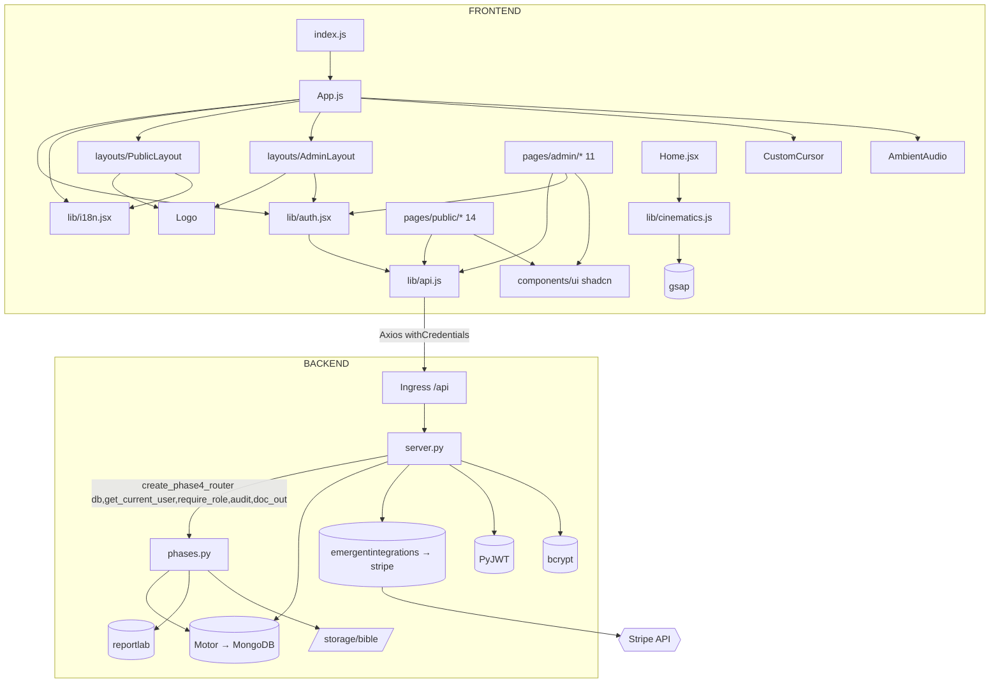

# 8. DÉPENDANCES ENTRE MODULES

## 8.1 Cartographie « qui appelle qui » — ✅ OBSERVÉ



## 8.2 Dépendances internes clés

| Appelant | Appelé | Nature | Couplage |
|---|---|---|---|
| server.py | phases.py | Injection de dépendances par factory (`create_phase4_router(db, get_current_user, require_role, audit, doc_out)`) + import des 3 seeds | **Faible/maîtrisé** — phases.py ne connaît ni l'env ni FastAPI app |
| App.js | lib/auth, lib/i18n | Contextes React providers | Faible |
| Toutes pages | lib/api.js | Instance Axios unique | Faible (point d'entrée unique = bon) |
| Home.jsx | cinematics.js | Hook animation | Faible |
| AdminLayout | lib/auth | user + logout | Faible |
| pages publiques | i18n | △ Partiel : seuls layouts + quelques CTA utilisent `t()` ; le corps des pages est en FR hardcodé | Incohérence |

## 8.3 Dépendances externes critiques

| Service/lib | Criticité | Point de défaillance |
|---|---|---|
| MongoDB (MONGO_URL) | ⛔ Vitale | Aucune app sans DB ; pas de retry/backoff custom |
| Stripe (clé test) | Haute | Billetterie + mécénat ; passage en live à valider |
| emergentintegrations | Haute | Wrapper propriétaire — migration vers SDK stripe direct possible (le SDK est déjà dans requirements) |
| Resend | Moyenne 🔧 | Mocké — magic links et emails Cercle inopérants en réel |
| Yousign | Moyenne 🔧 | Aucun code — statut `signed` manuel |
| Unsplash/Pixabay (URLs) | Moyenne | Images/audio hors contrôle CVLN (droits + disponibilité — audio déjà en 403) |
| Google Fonts / Fontshare | Faible | Typographies chargées par CDN |

## 8.4 Couplage & cohésion — analyse

**Points forts** ✅
- phases.py est un module à cohésion forte (domaine juridique/confidentiel) découplé par injection.
- Frontend : couche `lib/` propre, un seul client HTTP, contexts bien isolés.
- Zéro logique métier dupliquée entre front et back pour les montants (serveur source de vérité).

**Dette technique identifiée** ⚠️ (constatée, non corrigée — hors périmètre de cet audit sauf mention)
1. `server.py` monolithique (1 092 l.) : auth + CRUD + billing + seeds + contenu mélangés. 📋 Découper en routers (`auth.py`, `crud.py`, `public.py`, `billing.py`, `seeds.py`).
2. Date du gala dupliquée (server.py:845 et 921).
3. `CORS_ORIGINS` en .env non lu par le code (variable morte).
4. `SIGNED_TOKENS` in-memory : couplage à un déploiement mono-worker.
5. Suppressions sans cascade : supprimer une personne laisse assignments/contracts orphelins (tolérés en lecture mais incohérents).
6. `activate_seeded_founders()` écrase l'état admin (`public_visible`) à chaque boot.
7. requirements.txt contient ~90 paquets non importés (image de base) — surface d'attaque et poids inutiles.
8. i18n : dictionnaires embarqués dans un fichier JSX unique ; contenu éditorial non externalisé.
9. `constants/testIds/` sous-utilisé (les data-testid sont majoritairement inline).
10. Corrigé durant cet audit : imports manquants `useState/List/X` dans AdminLayout.jsx (crash runtime `/admin`).

## 8.5 Dépendances critiques — graphe de risque
```
MONGO_URL indisponible        → app entière KO (503 au premier accès DB)
STRIPE_API_KEY absente        → billetterie/mécénat KO (500), reste OK
JWT_SECRET changé             → toutes sessions invalidées (comportement sain)
Redémarrage backend           → SIGNED_TOKENS Bible purgés (liens 403), sessions JWT conservées
RESEND_API_KEY renseignée     → ⚠️ n'active PAS l'envoi réel (aucun SDK branché) — faux sentiment de sécurité
```
